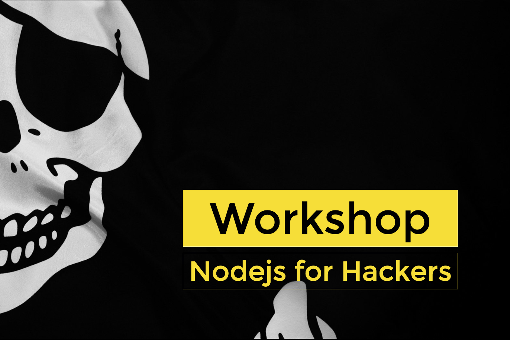

# workshop Node4hackers

Repositorio de trabajo del Workshop node4hackers

### Antes del evento

- Debes instalar Node [(Pasos y documentación)](https://nodejs.org/es/download/)
- Debes instalar Docker [(Pasos y documentación)](https://docs.docker.com/install/)
- En general no existe problema por usar cualquier sistema operativo, pero algunas librerías de terceros (que podríamos usar) solo las he probado en Linux/OSX, pero esto no será un problema para disfrutar el taller en cualquier caso :-)
- Prevemos tener problemas de conectividad por lo que deberiais hacer los siguientes pasos:
  - Clonaros este repositorio en el equipo que useis durante el taller `$ git clone https://github.com/UlisesGascon/workshop-node4hackers`
  - Entrar en la carpeta del repositorio clonado `$ cd workshop-node4hackers`
  - Instalar las dependencias que podriamos usar `$ npm install`, esto deberia generaros una carpeta (muy pesada) `/node_modules` y mostraros mucha información por la terminal (incluyendo warnings) esto es "normal" y hablaremos de ello en durante el taller
  - Nos bajamos la imagen de docker de [osminogin/tor-simple](https://hub.docker.com/r/osminogin/tor-simple/) `$ docker pull osminogin/tor-simple`
- Con todo esto... ya estás listo para el workshop!

### Durante el evento

- Seguramente tengamos baja conectividad y seamos muchas personas, es importante ser paciente
- Es normal perderse, para evitar esto cada pocos minutos ire subiendo lo que estoy haciendo al repositorio de github. Podras re-engancharte siplemente haciendo `git pull origin master` en la consola. Ya que esto te traerá todos los cambios :-)
- Si ves que puedes ayudar a otras personas, es una gran oportundiad que no deberias dejar pasar. Somos una comunidad princpalmente porque nos apoyamos entre todos y todas ^^.
- Muchas cosas las decidiremos al empezar (descansos, etc..)
- Si tienes una duda o quieres aportar algo, no dudes en hacerlo.
- Yo intentaré grabar la sesión con lo que no será tan critico que sigas mis pasos e intentes replicar lo que hago en tiempo real porque luego tendras el video para verlo todo de nuevo y rebobinar las veces que necesites. Recuerda que tambien voy subiendo el código cada poquito tiempo
- Mi objetivo como ponente es facilitaros todo lo que hago durante el taller con lo que tendreis todo el material, recursos, links, codigo, etc... asi te quitamos esa presión y puedes disfrutar mucho más de la experiencia ;-)

### Después del evento

- Vídeo del workshop
  <iframe src="https://www.youtube.com/embed/Lk0-14Xwjo0" frameborder="0" allow="accelerometer; autoplay; encrypted-media; gyroscope; picture-in-picture" allowfullscreen></iframe>
- [Cuenta de Twitter](https://twitter.com/kom_256) y en el [canal oficial de telegram de hack madrid](https://t.me/hackmadrid)
- Puedes entrar en este repo y usar el código como quieras, recuerda que este repo tiene una licencia AGPLv3.
